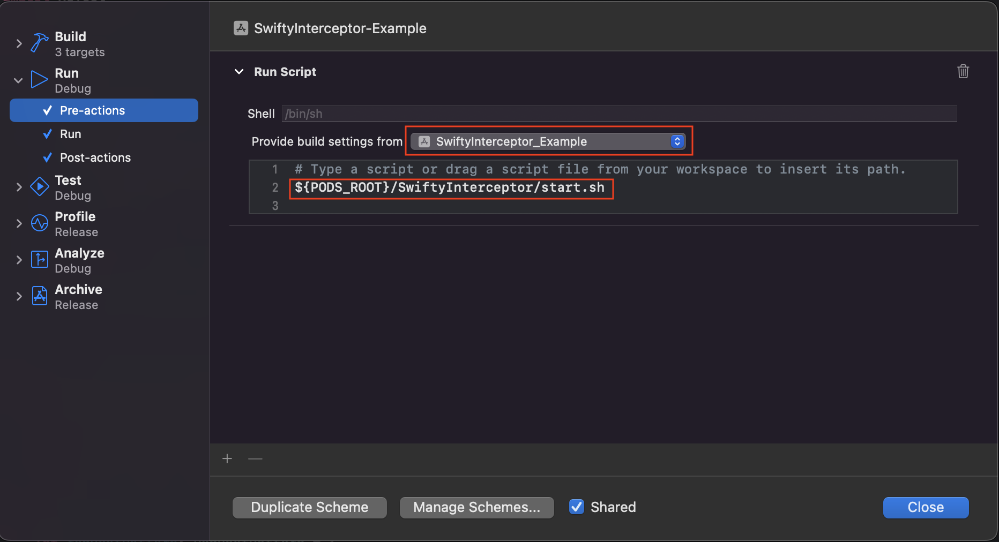
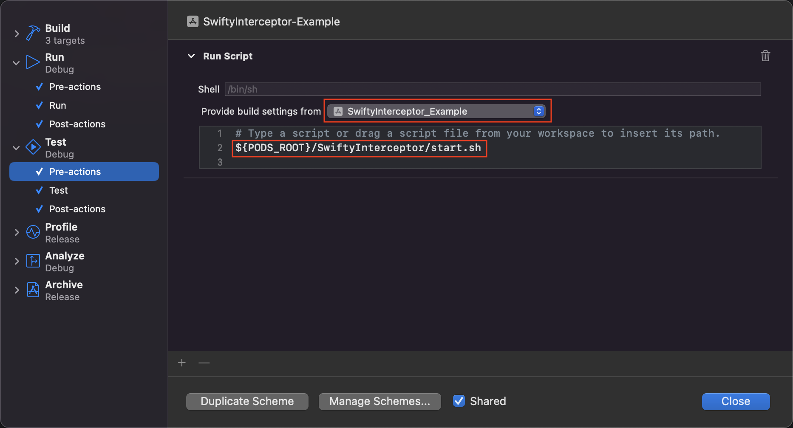
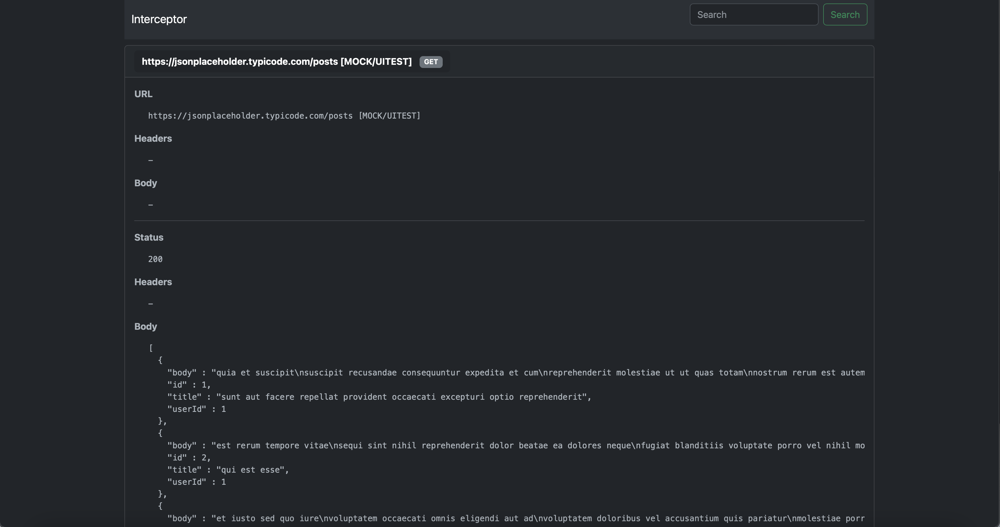

# SwiftyInterceptor

[](https://cocoapods.org/pods/SwiftyInterceptor)
[](https://cocoapods.org/pods/SwiftyInterceptor)
[](https://cocoapods.org/pods/SwiftyInterceptor)

## Features

- Log request/response
- Mock server
- Stub response using URLSession

## Example

To run the example project, clone the repo, and run `pod install` from the Example directory first.

## Requirements

- iOS 10.0+
- Xcode 10+
- Swift 4+

## Installation

SwiftyInterceptor is available through [CocoaPods](https://cocoapods.org). To install
it, simply add the following line to your Podfile:

```ruby
pod 'SwiftyInterceptor', :configurations => ['Debug']
```
## Logging setup



- Open `Schema/Edit scheme...`
- Select Run action
- Select `Pre-Actions`
  - Add `New Run Script action`
  - Provide build setting from `<YOUR_APP_TARGET>`
  - `${PODS_ROOT}/SwiftyInterceptor/start.sh`
- Select `Post-Actions`
  - Add `New Run Script action`
  - Provide build setting from `<YOUR_APP_TARGET>`
  - `${PODS_ROOT}/SwiftyInterceptor/stop.sh`

## UI Testing setup



- Open `Schema/Edit scheme...`
- Select Run action
- Select `Pre-Actions`
  - Add `New Test Script action`
  - Provide build setting from `<YOUR_APP_TARGET>`
  - `${PODS_ROOT}/SwiftyInterceptor/start.sh`
- Select `Post-Actions`
  - Add `New Run Script action`
  - Provide build setting from `<YOUR_APP_TARGET>`
  - `${PODS_ROOT}/SwiftyInterceptor/stop.sh`

## Log dash board



```
http://localhost:8888
```

## Usage for Unit Test

```
Interceptor.stubResponseHandler = { request in
    return .buildEncodable(url: request.url, body: Post.mock())
}
```

## Usage for UI Test

- Set environment variable `INTERCEPTOR_UITESTING_ENABLED` = `"1"`
```
app.launchEnvironment["INTERCEPTOR_UITESTING_ENABLED"] = "1"
```
- Mock response
```
struct MockPost: Mockable {
    let requestPattern: RequestPattern = {
        RequestPattern(method: "GET", url: PatternMatch(kind: .path, value: "posts"))
    }()
    let response: Stub = {
        .buildString(url: nil, body: jsonFromFile(name: "response.json"))
    }()
}
Interceptor.mock(MockPost())
```

## Note
Works only on iOS simulator due to server run on local machine.
More details checkout example project.

## Author

Chittapon Thongchim

## License

SwiftyInterceptor is available under the MIT license. See the LICENSE file for more info.
